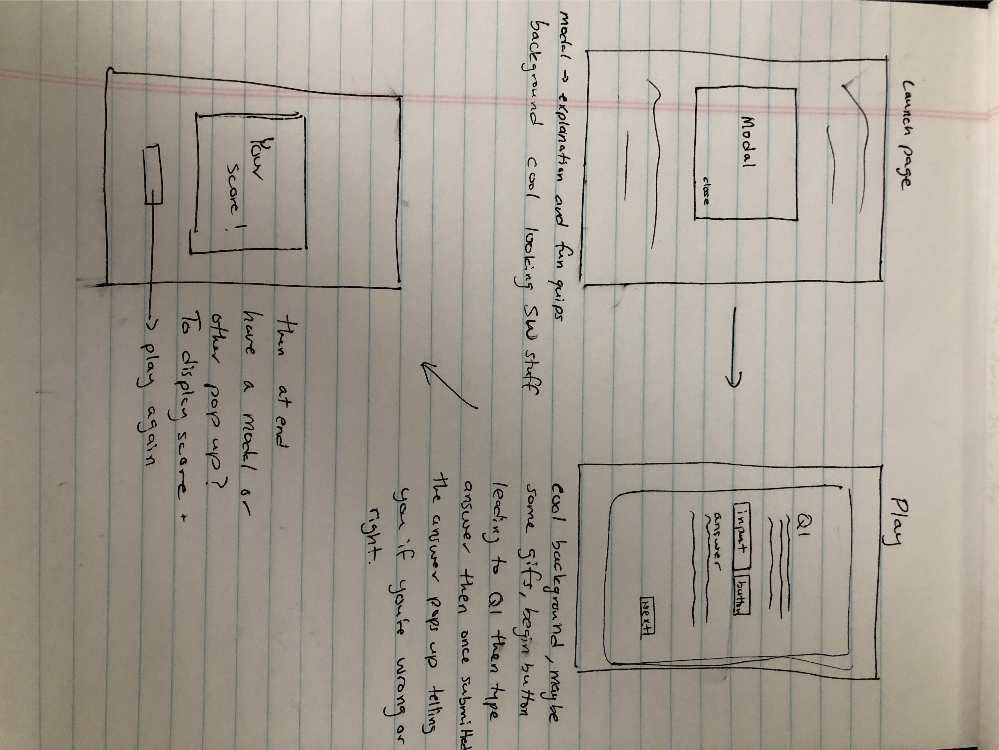

# Star Wars Trivia

## Screenshot of App:

---

## Installation Instructions:

Fork and clone to add to it as you will! Submit pull request to be a part of this small corner of the galaxy.

---

## User Stories:

The users of this game may be casual fans of Star Wars, or casual fans of trivia, or maybe they're the galaxy's meanest, leanest knowledge hunters out there.

- As a trivia player, I want a place that displays the question so I know what I’m answering
- As a trivia player, I want a place to type in my answer so I can play
- As a trivia player, I want multiple choice for certain questions, because some are more difficult to remember spelling
- As a trivia player, I want to know how many I’ve gotten right so I can see how well I do
- As a trivia player, I want a cool looking game, so it’s fun to play and look at
- As a trivia player, I want to see the right answer if I didn’t get it right, so I can learn more
- As a trivia player, I want a replay button so I can play again and see if there are more questions or if I can score higher on the same ones
- As a trivia player, I want to be timed because I like a challenge

---

## Technologies used:

No APIs were used in the creation of this game

---

## Wireframes:

---

## Problems / Hurdles:

I found it difficult to make my code more dry. I feel as though I was very close to getting it to do what I wanted in a much more efficient way but I couldn't find what I was missing, which I know is just syntax I'm missing, probably a line or two. I also couldn't figure a way to have a score be kept and saved for the user which I spent a lot of time trying to figure out but was unsuccessful. However, I did like struggling through and making it work in my own way and then I can learn how to improve and refactor it down the line.
